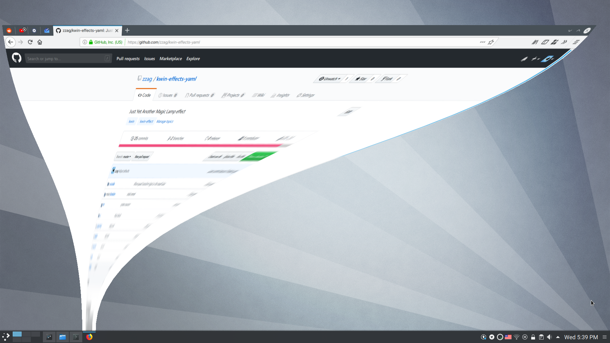

# Yet Another Magic Lamp



[Demo](https://www.youtube.com/watch?v=BR4bUwFZDS8)

Yet Another Magic Lamp is a window minimization effect for KWin. Whenever a window
is minimized, it'll get sucked down into the dock/panel. The main difference
between this effect and the one shipped with KWin is that this effect is more
"curvy". In addition to that, this effect works correctly with weird setups
(e.g. the panel is between screens) and has more configuration options.

This is mostly eye-candy stuff. If you want to be more productive, consider
using another window minimize animation (e.g. [Scale](https://store.kde.org/p/1267839/), etc).

### Installation

#### Binary package && Build from source

See: [zzge](https://github.com/zzag/kwin-effects-yet-another-magic-lamp).

### How to use

I have compiled it on 13 August./我在2020.8.13编译好了，进入build文件夹，sudo make install

```sh
git clone https://github.com/Vaimibao/kwin-effects-yet-another-magic-lamp.git

cd kwin-effects-yet-another-magic-lamp

cd build

sudo make install
```
### Using the effect

Go to System Settings > Desktop Behavior > Desktop Effects, and select
"Yet Another Magic Lamp", then click Apply.

deepin：
  1.安装systemsettings：sudo apt install systemsettings

  2.打开KDE 系统设置 -- 桌面行为 -- 桌面特效 -- Appearance下找到Yet Another Magic Lamp（应该是倒数第三） -- Apply

  3.deepin V20 存在特效问题，等待作者zzge更新，deepin 15.11没有问题

### Contributing

Any help is welcome. If you have suggestions how to improve this effect(e.g.
different duration for each stage of the animation, etc), please create a new
issue. If you'd like to contribute by implementing some feature, make sure
you've run clang-format before creating a PR.
